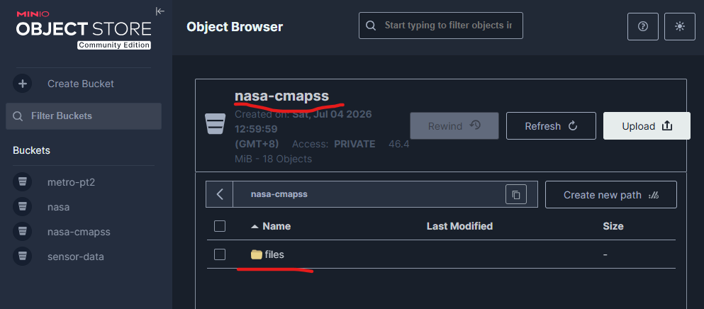
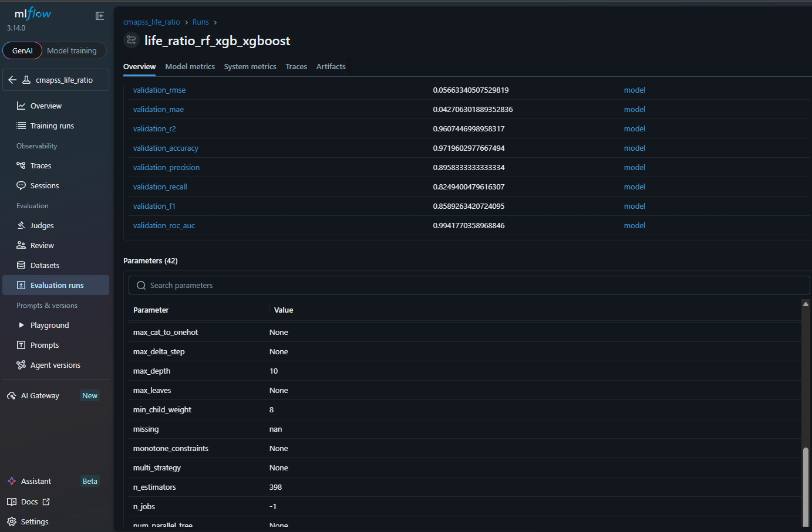
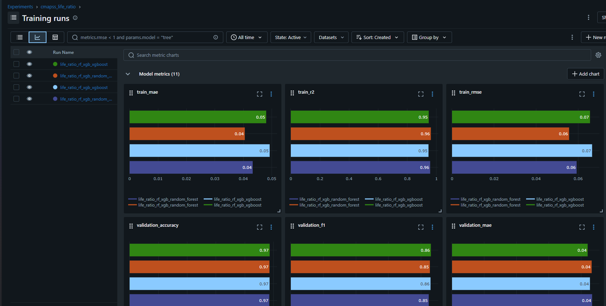
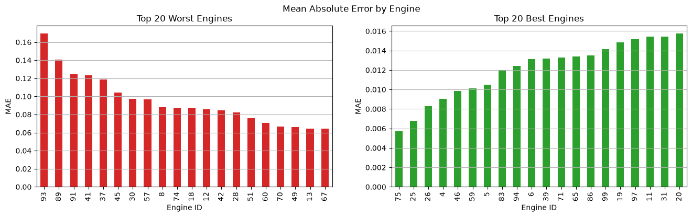
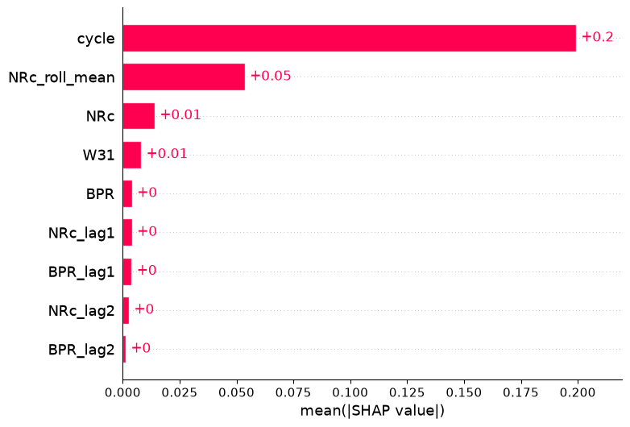
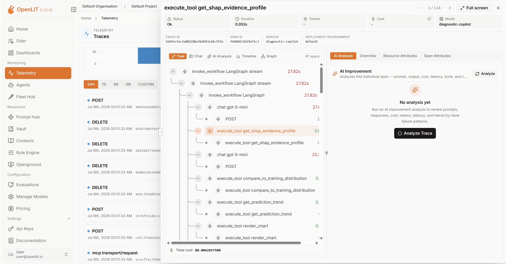

# Agentic Predictive Maintenance

An end-to-end time series machine learning project on the NASA CMAPSS dataset, combining data science, MLOps, and an agentic/generative AI workflow for descriptive, diagnostic, and predictive analytics.

## ✨ What this project includes

- A complete data science workflow for engine life span prediction
- Structured notebooks for exploratory data analysis and modeling
- A config-driven data preprocessing pipeline that reproduces the notebooks' logic with
  adjustable knobs (target, splits, feature engineering, feature selection) via YAML
- A config-driven model training pipeline (Optuna tuning, SHAP explainability, MLflow
  experiment tracking and model registry) for RandomForest and XGBoost
- A test-set evaluation entry point that scores a trained model (from MLflow or a local
  path) against the held-out CMAPSS test set, with the same metrics and plots as training
- A stateless real-time inference API (FastAPI) and a Streamlit demo that replays raw
  engine sensor readings as a live feed, with SHAP explanations and a simulated
  sensor-drift button
- An optional **Diagnostic Copilot** agent ([src_agent/](src_agent/)) - MCP server +
  LangChain agent + multimodal RAG for trust-calibrated Q&A over the inference log ("can I
  trust this prediction?"), backed by OpenAI or local Ollama, with optional OpenLIT tracing
- Four Docker Compose stacks under [docker/](docker/) for running any of the above with no
  local Python environment (see Live demo below)
- DVC-based data versioning with a local MinIO remote for development
- Modular Python utilities and configuration for repeatable experimentation

## 🎬 Live demo

*(Video was converted from .mp4 to .gif, watch the original images/demo-agent.mp4 for better quality)*

<p align="center">
  
</p>

*(walkthrough of the app with a pre-ingested knowledge base)*

The demo walks through these example prompts to the Diagnostic Copilot:

| Prompt | What it's trying to show |
| --- | --- |
| "What is the status of engine 75?" | Agent fetching real time data via MCP tools |
| "Plot the shap values and model predictions against cycle." | Generative BI capability, plotting graphs |
| "What does Ps30 measure?" | Regular text-only RAG |
| "Check the knowledge base and tell me which engine has the highest error?" | Multimodel RAG, fetching details from `rag_documents/xgboost_error_by_engine.png` |

The fastest way to see everything running - inference API, Streamlit demo, and the
Diagnostic Copilot with LLM tracing - is one Docker Compose stack. Just Docker and the
model artifacts, no local Python environment:

```bash
# One-time: fetch the real trained_model/ files 
git lfs pull

docker compose -f docker/docker-compose.agent-tracing.yml up --build
```

Then open:

- **http://localhost:8501** - the Streamlit demo: a live inference feed with SHAP
  explanations and a sensor-drift button, plus the Diagnostic Copilot chat tab
- **http://localhost:3000** - the OpenLIT dashboard for LLM observability (tokens, cost,
  latency, and the full tool-call trace per chat turn)

`OPENAI_API_KEY` is picked up from a repo-root `.env` if present; without one, everything
else still works and the Copilot's OpenAI backend just needs a per-request key in the UI
(or switch to Ollama).

**Other stacks under [docker/](docker/)**, depending on what you actually need:

- **`docker-compose.inference.yml`** - inference API + Streamlit only, no Diagnostic
  Copilot (smallest image, no LangChain/Chroma).
- **`docker-compose.full.yml`** - adds this project's own MinIO + MLflow (the local dev
  stack from "Getting started" below); still no Diagnostic Copilot.
- **`docker-compose.agent.yml`** - the featured stack without OpenLIT/ClickHouse -
  lighter, no tracing UI.

See "Real-time inference" and "Diagnostic Copilot" below for architecture details and
running without Docker.

## 🏗️ Architecture


*(placeholder - diagram of the full stack: data pipeline, training, inference API,
Streamlit demo, and the Diagnostic Copilot agent + RAG)*

## 📁 Project structure

```text
.
├── app/                            # Streamlit demo (+ copilot.py)
├── configs/                       # YAML configs for pipeline runs
│   ├── data_transformation/       # Data preprocessing pipeline configs
│   ├── model_training/            # Model training pipeline configs
│   ├── deployment/                # Inference-serving config (model, DB path)
│   └── agent/                     # Diagnostic Copilot config (default.yaml, docker.yaml,
│                                  # precomputed training_statistics.json)
├── data/                          # Versioned datasets and DVC metadata
├── docker/                        # Dockerfiles + Compose stacks (inference, full, agent,
│                                  # agent-tracing)
├── notebooks/                     # EDA and modeling notebooks
├── scripts/                       # Entry-point scripts (run_data_preparation.py,
│                                  # run_model_training.py, run_test_set_eval.py,
│                                  # run_training_stats.py, run_rag_ingest.py)
├── src/                           # Reusable Python modules
│   ├── components/                # Individual pipeline steps (ingestion, feature engineering,
│   │                               # test-set ingestion, model training/loading, evaluation,
│   │                               # explainability, inference + deployment logging)
│   ├── configs/                   # Pydantic config schemas + YAML loaders
│   ├── models/                    # Model factory + interfaces
│   ├── pipeline/                  # Orchestrators that chain components together
│   ├── serving/                   # FastAPI inference service (api.py, schemas.py,
│   │                               # request_helpers.py)
│   └── plots.py                   # Evaluation/explainability plotting functions
├── src_agent/                     # Diagnostic Copilot: MCP server, LangChain agent, RAG
│   ├── api.py                     # FastAPI agent service (SSE chat endpoint)
│   ├── agent.py                   # LangChain tool-calling agent + event streaming
│   ├── config.py                  # Pydantic config schemas + YAML loader
│   ├── prompts.py                 # Diagnostic Copilot system prompt
│   ├── channels.py                # Splits tool output: model text vs UI-only side channel
│   ├── schemas.py                 # Request/response schemas
│   ├── tracing.py                 # OpenLIT tracing init
│   ├── backends/                  # OpenAI / Ollama chat + embedding model builders
│   ├── mcp_server/                # FastMCP server + six analytics tools (server.py, tools/)
│   └── rag/                       # Knowledge-base ingestion + retrieval (readers,
│                                  # splitters, ingestion_pipeline.py, retrieval_pipeline.py)
├── tests/                         # Unit tests + in-memory integration tests + agents_test.py
├── training_logs/ , test_logs/    # Generated plots per run (gitignored)
├── mlruns/ , mlflow.db             # MLflow tracking store and artifacts (gitignored)
├── monitor/                       # Real-time inference log DB + deployment logs (gitignored)
├── trained_model/                 # Locally saved models, opt-in (tracked via Git LFS)
├── minio-data/                    # Local MinIO storage for development
├── README.md                      # Project overview and setup guide
└── PLAN.md                        # Project planning notes
```

## 📅 Project schedule (1 week)

Built over seven days, end to end:

| Day | Focus |
| --- | ----- |
| 1   | DVC setup, dataset preparation, and project scaffolding |
| 2   | Data exploration and model-building experiments in Jupyter |
| 3   | Data preparation, training, and evaluation pipelines, tracked via MLflow |
| 4   | Inference pipeline, FastAPI service, and Streamlit demo for real-time prediction |
| 5   | Dockerized the stack (Compose) and set up GitHub Actions CI/CD |
| 6   | Generative AI integration: LangChain agent, MCP, multimodal RAG, and LLM tracing (LLMOps) |
| 7   | Documentation cleanup, demo video, and architecture diagram |

Tasks are managed using Github Issues, please refer.

## 🚀 Getting started

### 1. Create a Python environment

```bash
python -m venv .venv
source .venv/bin/activate
pip install -U pip
```

### 2. Install the required tools

```bash
pip install "dvc[s3]" jupyter
```

### 3. Start a local MinIO server

```bash
docker run -p 9000:9000 -p 9001:9001 \
  -v ./minio-data:/data \
  -e MINIO_ROOT_USER=<USERNAME> \
  -e MINIO_ROOT_PASSWORD=<PASSWORD> \
  minio/minio server /data --console-address ":9001"
```

### 4. Configure DVC with the local MinIO remote

```bash
dvc remote add -d minio s3://nasa-cmapss
dvc remote modify minio endpointurl http://localhost:9000
dvc remote modify minio --local access_key_id <USERNAME>
dvc remote modify minio --local secret_access_key <PASSWORD>
dvc remote modify minio use_ssl false
```

### 5. Track and push data

```bash
dvc add data/raw/
dvc push
```

After pushing, the `nasa-cmapss` bucket in the MinIO console should show the tracked data:



### 6. Fetch the trained model (Git LFS)

`trained_model/` (RandomForest/XGBoost artifacts used by test-set eval, the inference API,
and the Streamlit demo) is tracked with [Git LFS](https://git-lfs.com), not DVC. Install it
once per machine, then pull the real files:

```bash
# One-time per machine
sudo apt install git-lfs
git lfs install

# Fetch the real content:
git lfs pull
```

Verify it worked: `git lfs ls-files` should list every tracked file, and
`trained_model/life_ratio_rf_xgb/*/model.pkl` should be real size (tens of KB+), not a
~130-byte pointer file.

## 📓 Notebooks

- [notebooks/step1_eda_RUL.ipynb](notebooks/step1_eda_RUL.ipynb) - exploratory data analysis and feature understanding
- [notebooks/step2_modeling_RUL.ipynb](notebooks/step2_modeling_RUL.ipynb) - model training and evaluation, predicting raw RUL
- [notebooks/step3_modeling_life_ratio.ipynb](notebooks/step3_modeling_life_ratio.ipynb) - same workflow, predicting `life_ratio` (RUL normalized to [0, 1]) instead

## 🧹 Data preprocessing pipeline

The notebooks' data preparation logic is also available as a config-driven pipeline under
`src/`, so it can be re-run with different settings without editing notebook cells. It
operates on independent per-engine time series (grouped by `engine_id`, ordered by `cycle`);
any step that fits a statistic (scaler, feature selection) fits on the training split only,
to avoid leakage.

### Pipeline steps (run in the order listed in the config)

1. **`train_validation_split`** - loads `data/raw/train_FD001.txt` and splits by
   `engine_id` (not by row), so no engine's cycles leak across the train/validation split.
2. **`preprocessing`** - computes the target column (`RUL`, or `life_ratio = RUL / max_cycle`,
   bounded [0, 1]) and drops configured columns (operating settings, redundant/constant sensors).
3. **`missing_value_handling`** - fills missing sensor readings per engine: linear
   interpolation for interior gaps, forward/backward-fill for edge gaps interpolation can't
   reach. Current raw data has none, but this keeps the pipeline robust for future data.
4. **`scaling`** - fits a `StandardScaler` on the training split's sensor columns only, then
   applies it to both splits.
5. **`feature_engineering`** - adds per-engine rolling-mean and lag features for each sensor,
   then drops the rows left with missing values from the lag window.
6. **`feature_selection`** - ranks features by `|correlation| * variance` against the target
   (fit on train only) and keeps the top-k.

### Configuring a run

Edit [configs/data_transformation/default.yaml](configs/data_transformation/default.yaml)
(or copy it and point `--config` at your copy). Key knobs:

```yaml
target:
  type: "life_ratio"  # or "rul" to predict raw remaining cycles instead

train_validation_split:
  test_size: 0.2
  random_state: 42

feature_selection:
  top_k: 10

pipeline:
  steps:               # comment a step out to skip it, or reorder them
    - "train_validation_split"
    - "preprocessing"
    - "missing_value_handling"
    - "scaling"
    - "feature_engineering"
    - "feature_selection"
```

### Running it

```bash
# any environment with requirements.txt installed
python scripts/run_data_preparation.py --config configs/data_transformation/default.yaml
```

This writes (paths configurable under `paths:` in the YAML):

- `data/processed/train.csv`, `data/processed/val.csv` - the processed splits
- `data/processed/artifacts/scaler.pkl` - the fitted `StandardScaler`
- `data/processed/artifacts/selected_features.json` - the selected feature names

Progress, warnings (e.g. missing values filled, zero-variance features), and errors are
logged to both the console and `logs/<timestamp>.log`.

### The held-out test set

The same script also prepares `data/raw/test_FD001.txt` + `data/raw/RUL_FD001.txt` into
`data/processed/test.csv`, via the `test_set:` section. This set is *censored* (engines
don't run to failure), so `test_set_ingestion` reconstructs the target from the terminal
RUL answer key (`RUL = rul_at_last_cycle + (last_cycle - cycle)`) instead of reusing
`train_validation_split`/`preprocessing`; `scaling`/`feature_selection` reuse the scaler and
selected-feature list already fit on the training split (`paths.scaler_path` /
`paths.selected_features_path`) rather than refitting:

```yaml
test_set:
  raw_data_path: "data/raw/test_FD001.txt"
  raw_rul_path: "data/raw/RUL_FD001.txt"
  processed_test_path: "data/processed/test.csv"
  pipeline:
    steps:
      - "test_set_ingestion"
      - "missing_value_handling"
      - "scaling"
      - "feature_engineering"
      - "feature_selection"
```

## 🤖 Model training pipeline

Config-driven hyperparameter tuning, evaluation, explainability, and experiment tracking,
built on top of the processed train/val CSVs from the data preprocessing pipeline above.

### What it does, per configured model (`random_forest` and `xgboost` by default)

1. Runs an Optuna hyperparameter search (`n_trials` per model), fitting on train and
   minimizing validation RMSE.
2. Computes regression metrics (RMSE, MAE, R²) on train and validation, plus precision,
   recall, f1, and ROC-AUC on validation by thresholding the continuous prediction into a
   "near failure" binary label (`life_ratio <= threshold`, mirroring the notebook).
3. Computes SHAP values for a sample of validation rows.
4. Generates plots (below) and saves them to `training_logs/<run_name>/<model_name>/plots/`.
5. Logs the model config, hyperparameters, train/validation metrics, dataset lineage, plots,
   and the fitted model to MLflow, with optional Model Registry registration.

Plots, written by [src/plots.py](src/plots.py):

- Actual vs predicted (train and validation)
- Train vs validation RMSE per Optuna trial (tuning convergence / overfit check)
- SHAP beeswarm and bar plots
- Residuals vs true value, absolute error vs cycle, mean absolute error by engine
- Confusion matrix and ROC curve for the near-failure binary classification

### Configuring a run

Edit [configs/model_training/default.yaml](configs/model_training/default.yaml). Key knobs:

```yaml
run_name: "life_ratio_rf_xgb"

models:
  - name: "random_forest"
    n_trials: 100
    # registered_model_name: "life_ratio_rf_xgb_random_forest"  # optional override
    save_locally: true # opt-in: also save to trained_model/<run_name>/<name>/model.pkl
    search_space:
      n_estimators: { type: "int", low: 100, high: 600 }
      # ...

binary_classification:
  threshold: 0.1 # life_ratio <= threshold => "near failure"
  pred_offset: 0.0

mlflow:
  tracking_uri: "sqlite:///mlflow.db"
  experiment_name: "cmapss_life_ratio"
```

Each model registers in the MLflow Model Registry under its own name - `registered_model_name`
defaults to `<run_name>_<model_name>` (e.g. `life_ratio_rf_xgb_random_forest`) so
RandomForest and XGBoost don't collide. Load one directly with
`mlflow.pyfunc.load_model("models:/<name>/<version>")`.

`save_locally` is off by default; enabling it also writes the fitted model to
`trained_model/<run_name>/<model_name>/model.pkl` (or `save_model_path`), so test-set
evaluation can score it with no MLflow dependency.

### Running it

```bash
python scripts/run_model_training.py --config configs/model_training/default.yaml
```

Each model gets its own MLflow run under the configured experiment. Explore results with:

```bash
mlflow ui --backend-store-uri sqlite:///mlflow.db
```

On this dataset both models land around RMSE ≈ 0.057, R² ≈ 0.96 on `life_ratio`, matching
`step3_modeling_life_ratio.ipynb` (numbers vary run to run - Optuna isn't seeded).

A single run's logged metrics and parameters:



Comparing runs side by side (RandomForest vs. XGBoost, train and validation metrics):



## 🧪 Test-set evaluation

Scores an already-trained model against `data/processed/test.csv` (from the data
preprocessing pipeline above) with the same metrics and plots as training - just on the
held-out test set, for one model instead of a list.

The model can come from either MLflow or a local path, so this script has no MLflow
dependency at all when using the latter:

```bash
# From MLflow (registered model)
python scripts/run_test_set_eval.py --model "models:/life_ratio_xgboost/1"

# From a local path (requires save_locally: true during training)
python scripts/run_test_set_eval.py --model trained_model/life_ratio_rf_xgb/xgboost
```

Every setting has a CLI flag (`--threshold`, `--pred-offset`, `--target-type`,
`--sample-size`, `--plots-output-dir`, `--no-plots`, ...) with sensible defaults. An
optional `--config path/to.yaml` overrides any subset - **fields present in the YAML win
over the matching CLI flag** - so a config only needs the values it wants to change:

```yaml
# overrides.yaml
model: "models:/life_ratio_xgboost/1"
threshold: 0.15
```

```bash
python scripts/run_test_set_eval.py --threshold 0.1 --config overrides.yaml
# runs with threshold=0.15 (config wins), not 0.1
```

Plots go to `test_logs/<model>/plots/`, `<model>` derived from `--model` (e.g.
`trained_model/life_ratio_rf_xgb/xgboost` -> `life_ratio_rf_xgb/xgboost`) via
[src/plots.py](src/plots.py), the same functions training uses. Metrics log to console and
`logs/<timestamp>.log`.

## Preliminary results

Test-set evaluation (`life_ratio` target) for both models trained on FD001:

| Metric    | RandomForest | XGBoost    |
| --------- | ------------ | ---------- |
| RMSE      | 0.0668       | **0.0667** |
| MAE       | **0.0476**   | 0.0479     |
| R2        | 0.9140       | **0.9142** |
| Accuracy  | 0.9946       | **0.9947** |
| Precision | **0.7117**   | 0.7025     |
| Recall    | 0.6752       | **0.7265** |
| F1        | 0.6930       | **0.7143** |
| ROC AUC   | 0.9968       | 0.9968     |

XGBoost edges out RandomForest on RMSE, R2, and near-failure classification (recall, F1);
RandomForest is marginally better on MAE and precision. Since RUL prediction is
fundamentally a regression problem, **XGBoost** is the better overall model - its plots
are below.

**Error by engine** - MAE per engine on the test set, worst and best:



Engines 25, 75, and 26 have the lowest errors.

**SHAP feature importance** - mean absolute SHAP value per feature:



Aside from `cycle`, `Ps30` (static pressure at HPC outlet) is the most important sensor
feature, based on 10 samples.

## 🔌 Real-time inference (API + demo)

[src/pipeline/inference_pipeline.py](src/pipeline/inference_pipeline.py) turns a raw sensor
reading window into a model-ready feature row, reusing the same
[src/components/feature_engineering.py](src/components/feature_engineering.py) functions
as training. It's **stateless**: each call takes the full window of recent raw readings for
one engine (oldest to newest) and recomputes rolling/lag features from scratch - no
per-engine history kept, the client owns that buffer. The scaler and selected-feature list
come from the serving model's own bundled `preprocessor/` folder (see "Model training
pipeline" above), not a standalone path, so a `model` reference is the single source of
truth, decoupled from
[configs/data_transformation/default.yaml](configs/data_transformation/default.yaml).

### The API

[src/serving/api.py](src/serving/api.py) exposes it over FastAPI, fully configured via
[configs/deployment/default.yaml](configs/deployment/default.yaml): which model to load,
MLflow tracking URI, log database path, preprocessing steps, and the rolling-window/lag
settings (must match training):

```bash
uvicorn src.serving.api:app --port 8000
```

- `GET /config` - the settings a client needs to build valid requests: `required_window_length`,
  `sensor_columns`, `selected_features`.
- `POST /predict` - body is `{"engine_id": int, "readings": [{"cycle": int, "values": {...}}, ...]}`;
  returns the predicted `life_ratio` plus a per-feature SHAP breakdown for that cycle.
- `GET /health` - liveness check.

Every prediction is logged to a SQLite database (`monitor/inference_log.db` by default) via
[src/components/inference_store.py](src/components/inference_store.py): a wide
`inference_readings` table (raw sensor values + prediction, one row per cycle) for
plotting, and a long/normalized `inference_shap_values` table (one row per feature per
prediction) so an LLM agent can query SHAP trends with plain SQL, no pivoting.
[src/serving/api.py](src/serving/api.py) also appends a line per prediction to
`monitor/logs/<YYYY-MM-DD_HH>.log` via
[src/components/deployment_logger.py](src/components/deployment_logger.py), a plain-text
deployment history for ops tooling - deliberately not part of the Diagnostic Copilot's
knowledge base (chat turns land there too, and re-ingesting the copilot's own past answers
would let it cite itself instead of the real data). `run_sql` and the other analytics tools
are how the copilot answers questions about live predictions instead.

### The demo

[app/streamlit.py](app/streamlit.py) replays three engines (75, 25, 26) as a live feed (1
cycle every N seconds, adjustable in the UI, default 10s) against the API. It reads from
the raw *training* file, not the test set, since the test set is censored (e.g. engine 75
stops at cycle 88 there) and never reaches failure - the training file has each engine's
full run to actual failure:

```bash
streamlit run app/streamlit.py
```

It shows the live predicted life-ratio, a SHAP bar chart for the current cycle, and each raw
sensor's trend as its own small chart (unscaled, so magnitudes are visible). When the
prediction drops below `life_ratio_threshold`
([configs/deployment/default.yaml](configs/deployment/default.yaml), default `0.1`,
matching training's near-failure threshold), the UI flags a predicted failure. A **drift**
control forces one chosen sensor to 0.0 in every subsequent reading - watch its SHAP
contribution and trend chart react live.

### Running the demo with Docker Compose

See "Live demo" at the top for the full stack (inference + Diagnostic Copilot + tracing).
For just this API + Streamlit demo, or the full local dev stack (also minio + mlflow),
use `docker-compose.inference.yml` / `docker-compose.full.yml` instead - see the bullet
list there for what each one runs. Either way, open **http://localhost:8501** for the
Streamlit demo; the `full` compose file additionally starts `minio`
(http://localhost:9001, this project's DVC remote) and `mlflow` (http://localhost:5000, an
MLflow UI for past training runs).

Two Dockerfiles: [docker/Dockerfile.inference](docker/Dockerfile.inference) is a lean,
serving-only image ([docker/requirements_inference.txt](docker/requirements_inference.txt),
DVC/Jupyter/training tooling stripped out) used by `model-server` and `streamlit` in *both*
compose files. [docker/Dockerfile.full](docker/Dockerfile.full) (the full root
[requirements.txt](requirements.txt)) is only used by `mlflow`, mirroring the local dev
stack rather than serving anything. Both build with the repo root as context (`context: ..`),
where `.dockerignore` and the copied source actually live. `streamlit` waits for
`model-server`'s `/health` check via `INFERENCE_API_URL=http://model-server:8000` (service
name as hostname on the Compose network).

## 🤖 Diagnostic Copilot (agent + multimodal RAG)

An optional service, [src_agent/](src_agent/), that lets an operator ask the inference log
questions instead of reading dashboards. Its signature capability is **trust calibration**:
the model relies most on `cycle` count at the start/end of an engine's life, and on raw
sensors mid-life, so a *stable* prediction isn't always a *healthy* engine - the Copilot
knows this and calibrates its verdicts accordingly (see the system prompt in
[src_agent/prompts.py](src_agent/prompts.py)).

**Architecture:**

- [src_agent/mcp_server/](src_agent/mcp_server/) - a FastMCP server (no LangChain
  dependency, any MCP client can use it) exposing six read-only analytics tools:
  `get_shap_evidence_profile` (headline tool - cycle-share vs sensor-share of SHAP per life
  phase), `get_shap_trend`, `compare_to_training_distribution` (OOD z-scores against
  `configs/agent/training_statistics.json`), `get_prediction_trend`, `run_sql` (guarded
  read-only SELECT), and `render_chart` (chart spec + text digest - raw series data never
  reaches the LLM, only the digest; the UI renders the spec).
- [src_agent/api.py](src_agent/api.py) - a LangChain tool-calling agent streamed over SSE,
  consuming the MCP tools via `langchain-mcp-adapters` plus a `knowledge_search` tool over a
  Chroma-backed knowledge base (CMAPSS sensor reference, this README, vision-captioned plots
  - see [src_agent/rag/](src_agent/rag/)). It's (re-)ingested automatically in the
  background on every startup (non-destructive upsert, cheap to repeat) - the six analytics
  tools serve immediately, `knowledge_search` joins the moment ingestion finishes, no
  restart needed. `GET /health` reports this as `rag_status`: `disabled` / `ingesting` /
  `ready` / `failed`.
- The Streamlit demo's **Diagnostic Copilot** tab ([app/copilot.py](app/copilot.py)) talks to
  it; the tab degrades to a hint if the agent service isn't running, and shows a banner while
  `rag_status` is `ingesting`, so the base demo never depends on it.

**Backends:** OpenAI (default; needs an API key, entered in the UI or via `OPENAI_API_KEY`)
or local Ollama (`qwen3.5:9b` default) - selectable per chat. Either way, the knowledge
base is embedded and its plots captioned with the *default* backend's embedder/caption_model
(`configs/agent/default.yaml` -> `backends:`); switching it requires re-running ingest
(below). `backends.default: "ollama"` means ingest - including captioning
`rag_documents/*.png` - never needs an OpenAI key.

### Running it locally (no Docker)

```bash
# One-time: precompute the drift tool's per-sensor training statistics
python scripts/run_training_stats.py

# One-time: start Chroma (src_agent.api ingests into it automatically on startup below -
# rag_documents/*.md and rag_documents/*.png (vision-captioned) plus this README)
docker run -d -p 8100:8000 -v chroma-data:/data chromadb/chroma

# Three long-running processes (separate terminals)
python -m src_agent.mcp_server.server   # port 8200
python -m src_agent.api                 # port 8300 - ingests the knowledge base in the
                                         # background on startup; GET /health -> rag_status
streamlit run app/streamlit.py          # Diagnostic Copilot tab reaches localhost:8300
```

Force a full knowledge-base rebuild (e.g. after adding docs, or switching the default
backend's embedder) without waiting for the next restart:

```bash
python scripts/run_rag_ingest.py --reset
```

### Running it with Docker Compose

See "Live demo" at the top for the full stack (`docker-compose.agent-tracing.yml`). Swap
in `docker-compose.agent.yml` for the same stack without OpenLIT/ClickHouse, if you don't
need the LLM tracing UI.

Both are complete, standalone stacks (model-server, streamlit, mcp-server, agent-server,
chroma), run from the repo root. `OPENAI_API_KEY` comes from a repo-root `.env` via
agent-server's `env_file` - no key is fine too, the OpenAI backend just needs a
per-request key from the UI. Ollama itself is **not** containerized; it runs on the host,
reached via `host.docker.internal`. agent-server ingests the knowledge base into the
containerized Chroma automatically once up - no manual step, the Copilot tab shows a
banner meanwhile. Force a rebuild with `python scripts/run_rag_ingest.py --reset` from your
bare-metal environment against `localhost:8100`, same as local-dev above.

Both compose files share [docker/Dockerfile.agent](docker/Dockerfile.agent) (built from
[docker/requirements_agent.txt](docker/requirements_agent.txt), scoped to `src_agent/` -
no scikit-learn/xgboost/shap/mlflow) for `mcp-server` and `agent-server`; only `command:`
differs. Networking overrides for the containerized case live in
[configs/agent/docker.yaml](configs/agent/docker.yaml) - minimal, since unset fields fall
back to `configs/agent/default.yaml`'s defaults. Tracing toggles via two env vars
(`AGENT_TRACING_ENABLED`, `AGENT_TRACING_OTLP_ENDPOINT`) rather than a third config file,
since fail-open tracing is the only difference between the two variants - an unreachable
OpenLIT never breaks a chat turn. The `agent-tracing` stack also runs a one-shot
`openlit-db-config` service that registers ClickHouse with the OpenLIT UI on first boot
(working around an upstream seed-script bug), so traces at http://localhost:3000 need no
manual login/setup.

A trace of one Diagnostic Copilot turn in the OpenLIT UI - the full tool-call tree (MCP
spans, `execute_tool` spans per analytics tool, the chat model calls) with per-span cost,
tokens, and duration:



## ✅ Running UT/IT

```bash
pytest tests/unit_test.py         # component-level unit tests
pytest tests/integration_test.py  # full data-prep -> train -> eval flow, gatekeeping
pytest tests/agents_test.py       # Diagnostic Copilot: MCP tools, agent loop, RAG
pytest tests/                     # everything
```

**Unit tests** (`unit_test.py`) exercise individual `src/components/` functions in
isolation with small, hand-built DataFrames - fast, no I/O, pinpoints exactly what broke.
**`agents_test.py`** does the same for `src_agent/`: MCP tool math against temp SQLite
fixtures, the SQL guard's rejections, the agent loop against a scripted fake chat model,
and the RAG readers/splitters - no live LLM calls, so it runs the same everywhere
`unit_test.py` does.

**Integration tests** (`integration_test.py`) run the real `DataPreparationPipeline` and
`TestSetPreparationPipeline` against the actual `data/raw/*.txt` files end-to-end (outputs
to a temp dir, never touching `data/processed/`), then fit RandomForest/XGBoost with their
real best hyperparameters (hardcoded, not re-searched) and assert metrics against a
captured baseline. These gatekeep a model before release - representative of real
performance, not just code correctness - so they need
`data/raw/{train,test,RUL}_FD001.txt` present.

> **Note:** production would run `dvc pull` in CI against a persistent remote, but this
> project's MinIO is local-dev-only with no server for CI to reach. FD001 is small (a few
> MB), so it's committed directly to git as a workaround.

## 🧹 Linting

`ruff check .` runs in CI (see [.github/workflows/tests.yml](.github/workflows/tests.yml)).
To catch violations locally before they reach CI, install the
[pre-commit](.pre-commit-config.yaml) hook once per clone:

```bash
pip install -r requirements.txt   # includes pre-commit
pre-commit install
```

Every `git commit` then runs `ruff check` against the files you've staged.

## 📝 Notes

This repository uses a local MinIO instance for development to keep data storage lightweight and inexpensive while preserving a realistic MLOps workflow.